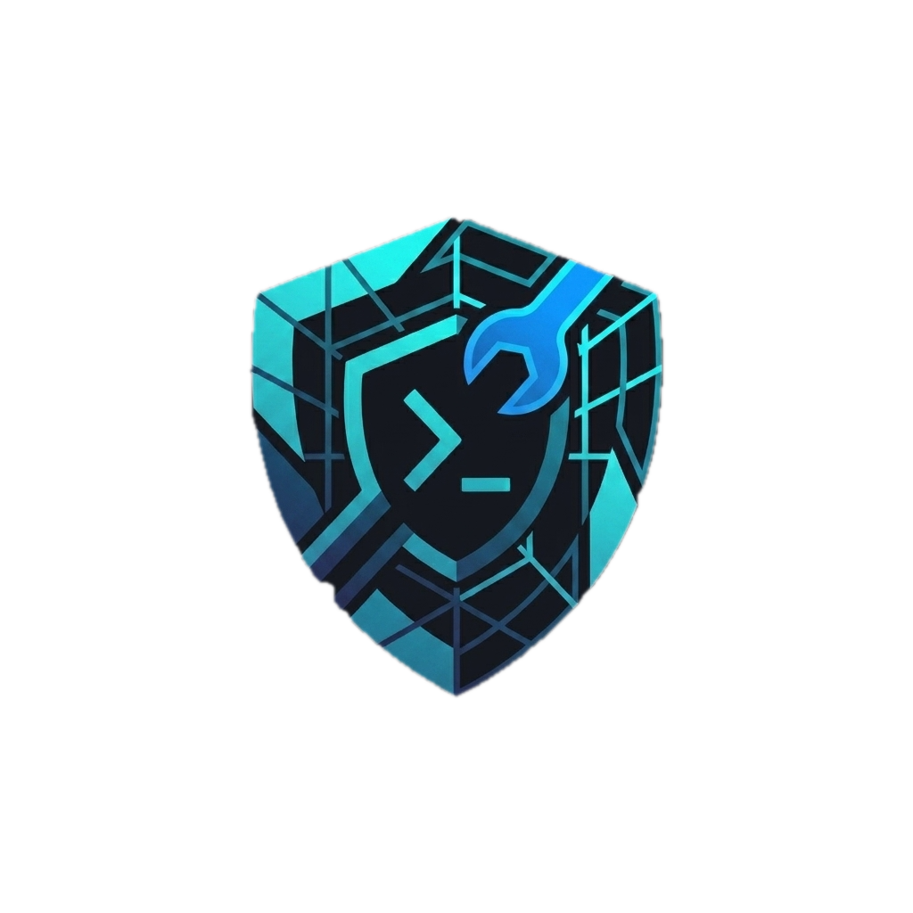
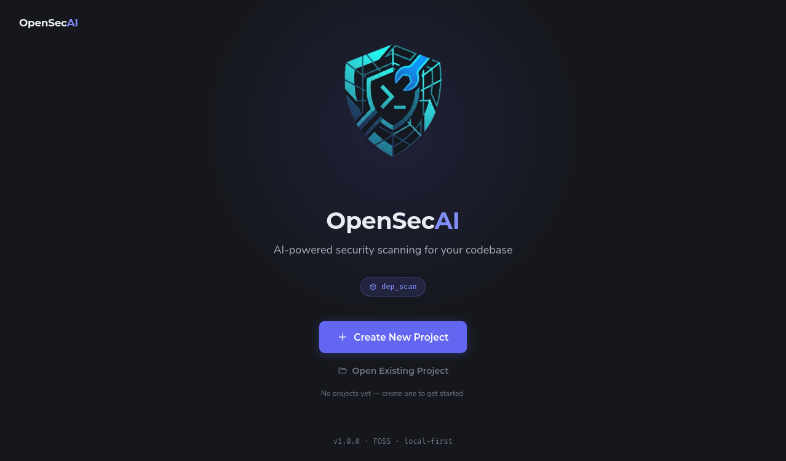
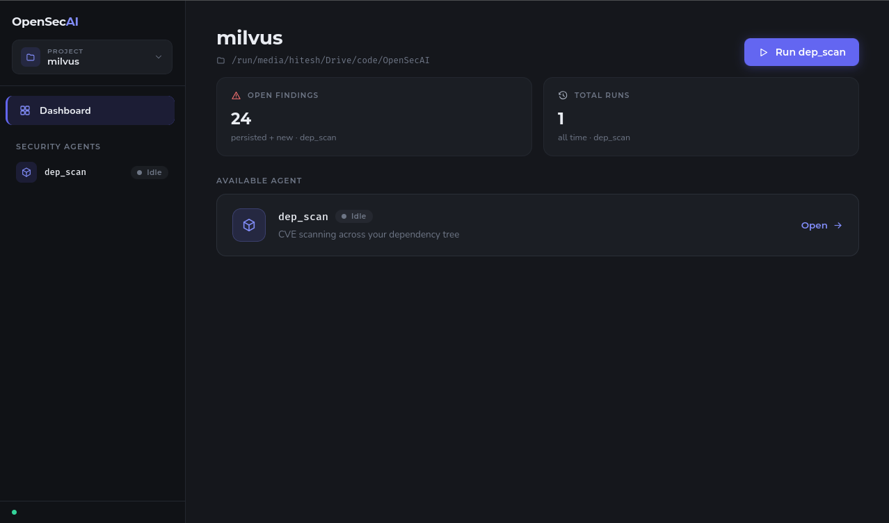
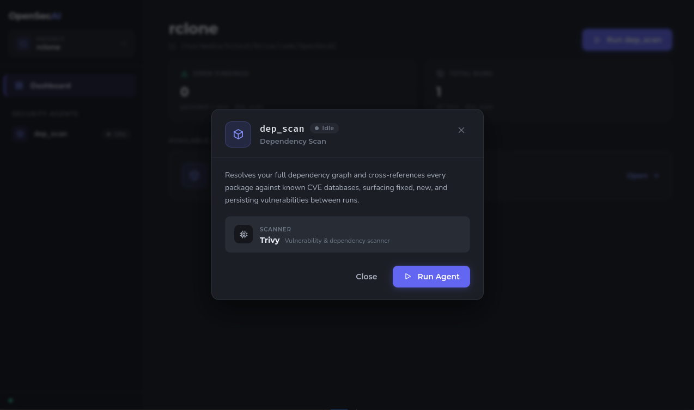
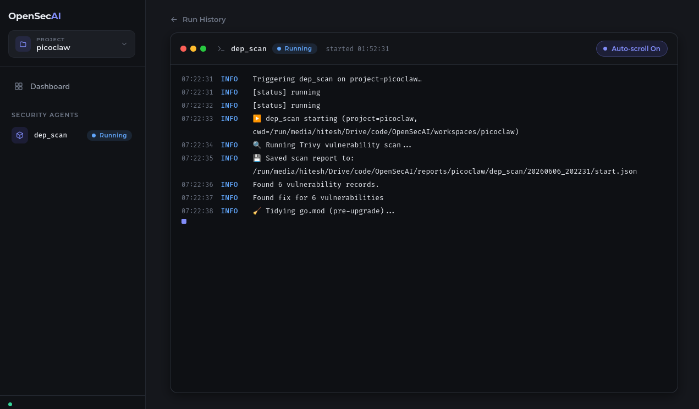
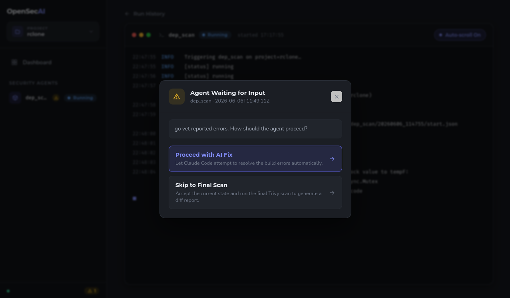
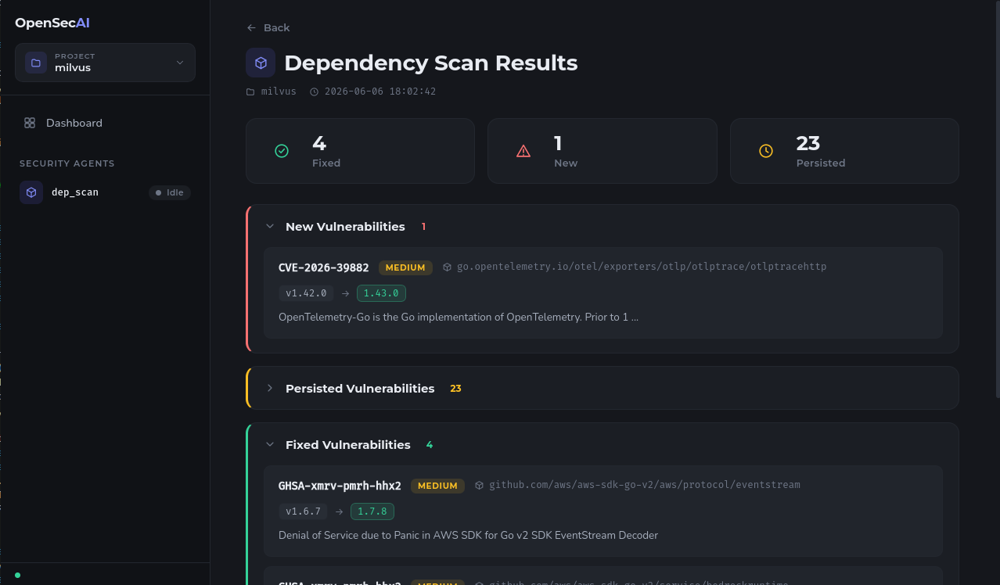

<p align="center">
  
</p>

<h1 align="center">OpenSecAI</h1>

**An end-to-end, AI-powered security scanner and auto-remediation platform. Run security agents locally, detect vulnerabilities, and self-heal breaking API changes automatically.**

---

<p align="center">
  <a href="https://www.python.org/"></a>
  <a href="https://www.rust-lang.org/"></a>
  <a href="https://www.typescriptlang.org/"></a>
  <a href="https://tauri.app/"></a>
  <a href="https://github.com/langchain-ai/langgraph"></a>
  <a href="https://github.com/hitesharma/OpenSecAI/blob/main/LICENSE"></a>
  
</p>


OpenSecAI orchestrates independent, local [LangGraph](https://github.com/langchain-ai/langgraph) agents managed via a modern Tauri-based desktop application. Run scans, interact with live logging, and review AI-driven patches without your source code or secrets ever leaving your machine.

- **Local & secure.** A Tauri desktop shell hosting a React frontend paired with a local FastAPI sidecar. No SaaS APIs, no external code uploads.
- **Autonomous self-healing.** Integrated LLM code-patching and [Claude Code](https://github.com/anthropics/claude-code) agents automatically remediate vulnerabilities, upgrade packages, and fix compilation errors.
- **Human-in-the-loop (HITL).** Uses LangGraph interrupts to pause, verify, and request decisions when build or analysis checks fail.
- **Currently Go-first.** Dependency scanning is currently supported for **Go (Golang)** projects, with support for more security domains (container scanning, SAST, secrets, IaC, SBOM, licensing) and programming languages planned for future releases.

Want a fully local, agentic security analysis pipeline running right on your workstation? **You're in the right place.**

---

## 🌟 Core Vision & Highlights

- **Single-User Desktop First**: Designed to run securely on a developer's local machine without exposing source code or secrets to external SaaS endpoints.
- **Autonomous Agents**: Built using LangGraph, agents scan target codebases, analyze results, and attempt self-healing/auto-remediation (using LLMs and [Claude Code](https://github.com/anthropics/claude-code) subprocesses) directly on the local filesystem.
- **Human-in-the-Loop (HITL)**: Utilizes LangGraph interrupts to pause execution and request human guidance (e.g., when breaking changes are detected and code modification is needed).
- **FastAPI Sidecar Backend**: A Python-based FastAPI server runs as a local sidecar managed by the Tauri app, running on `127.0.0.1` and secured with token handshakes.
- **SQLite Persistence**: SQLModel-backed SQLite database tracks projects, execution jobs, live agent event logs, and historical findings.
- **Typesafe Schema Codegen**: Pydantic models automatically export to JSON Schemas, which are then compiled directly to TypeScript types for UI consumption.

---

## 📸 Screenshots

<table>
  <tr>
    <td width="50%">
      <p align="center"><b>Landing Page</b></p>
      
    </td>
    <td width="50%">
      <p align="center"><b>Agent Dashboard</b></p>
      
    </td>
  </tr>
  <tr>
    <td width="50%">
      <p align="center"><b>Run Configuration</b></p>
      
    </td>
    <td width="50%">
      <p align="center"><b>Live Job Logs & Progress</b></p>
      
    </td>
  </tr>
  <tr>
    <td width="50%">
      <p align="center"><b>Human-in-the-Loop Decision</b></p>
      
    </td>
    <td width="50%">
      <p align="center"><b>Historical Reports Browser</b></p>
      
    </td>
  </tr>
</table>

---
## 🏗️ System Architecture

OpenSecAI consists of three main components: the Rust-based Tauri container, the React-based frontend webview, and the Python-based API sidecar running LangGraph agents.

```
┌──────────────────────────────────────────────────────────────────────────────┐
│  Desktop App Container (Tauri Process)                                       │
│                                                                              │
│   ┌─────────────────┐    Tauri IPC    ┌──────────────────────────────┐       │
│   │  React + Vite   │ ◄────────────►  │  Rust Shell (src-tauri)      │       │
│   │  (Webview UI)   │   invoke / event│  • Window management         │       │
│   │  desktop/src    │                 │  • Sidecar supervisor        │       │
│   └────────┬────────┘                 │  • Process termination       │       │
│            │ HTTP + WS                │    (SIGKILL via active_pid)  │       │
│            │ (127.0.0.1:8765)         └────────────┬─────────────────┘       │
│            ▼                                       │                         │
│   ┌────────────────────────────────────────────────┼─────────────────────┐   │
│   │  Python Sidecar — FastAPI (opensecai.api)      │                     │   │
│   │  ┌──────────┐  ┌──────────┐  ┌──────────┐  ┌───▼──────┐              │   │
│   │  │ Routes   │  │ WS App   │  │ Runtime  │  │ Storage  │              │   │
│   │  │ /agents  │  │ /ws/...  │  │ JobMgr   │  │ SQLite   │              │   │
│   │  │ /jobs    │  │ stream   │  │ EventBus │  │ stores   │              │   │
│   │  │ /projects│  │          │  │ registry │  │          │              │   │
│   │  │ /settings│  │          │  │          │  │          │              │   │
│   │  └────┬─────┘  └────┬─────┘  └────┬─────┘  └────┬─────┘              │   │
│   │       │             │             │             │                    │   │
│   │       └─────────────┴──────┬──────┘             │                    │   │
│   │                            ▼                    ▼                    │   │
│   │                  ┌──────────────────┐   ┌──────────────────┐         │   │
│   │                  │  Agent Runners   │   │  opensecai.db    │         │   │
│   │                  │  (dep_scan, ...) │   │  (Jobs/Projects/ │         │   │
│   │                  │  LangGraph       │   │   Settings)      │         │   │
│   │                  └────────┬─────────┘   └──────────────────┘         │   │
│   │                           │                                          │   │
│   └───────────────────────────┼──────────────────────────────────────────┘   │
└───────────────────────────────┼──────────────────────────────────────────────┘
                                ▼
                  ┌──────────────────────────────────┐
                  │ Target Filesystem (Per Project)  │
                  │   <root_dir>/                    │
                  │     workspaces/<repo>/           │  ← Target repository source code
                  │     reports/<proj>/              │
                  │       <agent>/                   │
                  │         index.json               │  ← Run logs and history
                  │         index.json.lock          │  ← Cross-agent concurrent lock
                  │         <run_id>/                │
                  │           start.json             │  ← Pre-healing scan report
                  │           end.json               │  ← Post-healing scan report
                  │           diff.json              │  ← Fixed/persisted vulns diff
                  │           events.jsonl           │  ← Replayable log stream
                  │           active_pid             │  ← Process PID (for instant kill)
                  └──────────────────────────────────┘
```

---

## 🚀 Getting Started

### Prerequisites

Make sure you have the following installed on your machine:
- **Python**: `>= 3.13`
- **Rust**: `>= 1.77.2` (Tauri v2 requirement)
- **Node.js**: `>= 20.0`
- **uv**: Python package and project manager (recommended)
- **Go (Golang)**: Required (the tool currently supports Go projects only)
- **Trivy**: Vulnerability scanner (required for `dep_scan`)

### Setup Environment

#### 🐧 Linux Quick Start (Automated Setup)
If you are running in a Debian/Ubuntu-based Linux environment, you can run the automated [setup.sh](https://github.com/hitesharma/OpenSecAI/blob/main/setup.sh) script to automatically verify and install all system dependencies (including Tauri dependencies, Node.js, Rust, Trivy, and `uv`), sync the Python environment, and install frontend node modules:
```bash
chmod +x setup.sh
./setup.sh
```

#### 🛠️ Manual Setup
1. Clone the repository and navigate to the project root:
   ```bash
   git clone https://github.com/hitesharma/OpenSecAI
   cd OpenSecAI
   ```

2. Copy the environment template and set up your keys:
   ```bash
   cp .env.example .env
   # Edit .env and configure your OPENAI_API_KEY / ANTHROPIC_API_KEY
   ```

3. Install all Python dependencies:
   ```bash
   uv sync
   ```

4. Install desktop app dependencies:
   ```bash
   cd desktop
   npm install
   cd ..
   ```


---

## 💻 Running the App

### Running the CLI Agent (Local Dev)
To run the default agent (`dep_scan`) directly on your CLI against a target workspace:
```bash
# Set target project and workspace name
export PROJECT=my-go-service
# Target workspace must exist under workspaces/my-go-service/ and contain a go.mod
make run
```

### Running the Tauri Desktop App (GUI)
To start the app in development mode (spawns both the Tauri desktop frame and the Python sidecar automatically):
```bash
make run-dev
```

### Running the API Sidecar Independently
If you want to debug FastAPI routes or test the API via tools like Swagger UI (`http://localhost:8765/docs`):
```bash
make api
```

---

## 🛠️ Development & Tooling

We use a central `Makefile` to consolidate standard development actions.

| Command | Action |
|---|---|
| `make install` | Create virtual environment and sync python dependencies |
| `make run` | Run the `dep_scan` agent on CLI using `main.py` |
| `make run-dev` | Start Tauri GUI app in development mode |
| `make api` | Boot up the FastAPI sidecar server |
| `make lint` | Run Ruff linter checks |
| `make format` | Reformat python code using Ruff formatter |
| `make typecheck` | Run Pyright static type analysis |
| `make codegen` | Export Pydantic models to JSON schemas and compile to TypeScript interfaces |
| `make clean` | Clean up build artifacts and `.venv` |

---

## 🤖 Adding a New Agent

Follow this recipe to add a new security domain agent:

1. **Scaffold Directory**: Create a subpackage inside `opensecai/agents/`:
   ```bash
   mkdir -p opensecai/agents/<agent_name>/prompts
   touch opensecai/agents/<agent_name>/{__init__,runner,graph,nodes,state}.py
   ```
2. **Register Entrypoint**: Register your agent's runner in `pyproject.toml` under `[project.scripts]`:
   ```toml
   opensecai-<agent_name> = "opensecai.agents.<agent_name>.runner:main"
   ```
3. **Sync Environment**: Run `uv sync` to update the script bindings in your environment.
4. **Implement Graph**: Inherit the context and register nodes using LangGraph's `StateGraph`. Ensure all paths are safely resolved via `opensecai/core/paths.py`.
5. **Add Tests**: Create unit tests under `tests/unit/agents/` and mocking fixtures under `tests/fixtures/`.

---

## 🧪 Testing

> [!NOTE]
> The test directories (`tests/unit/`, `tests/integration/`, `tests/e2e/`) are currently scaffolded skeleton structures containing `__init__.py` files. Actual test cases are planned for implementation in future phases.

If you wish to set up tests, you will first need to install `pytest` (e.g., `uv pip install pytest` or add it to `pyproject.toml`):

```bash
# Run all unit tests once pytest is installed
uv run pytest tests/unit

# Run integration tests
uv run pytest tests/integration
```

---

## 📜 License

This project is licensed under the Apache 2.0 License. See the [LICENSE](https://github.com/hitesharma/OpenSecAI/blob/main/LICENSE) file for more information.
